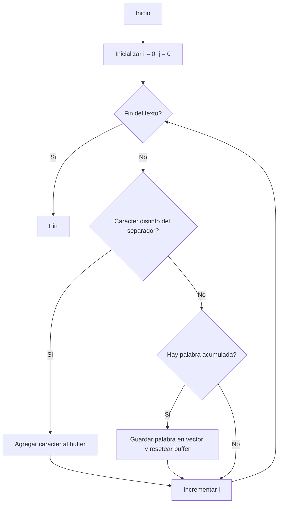

<div align="right">
    
</div>

# TP

## Información del estudiante

* Luciana Falcon
* 107316
* lfalcon@fi.uba.ar

---

## Índice
* [1. Instrucciones](#1-Instrucciones)
  * [1.1. Compilar el proyecto](#11-Compilar-el-proyecto)
  * [1.2. Ejecutar las pruebas](#12-Ejecutar-las-pruebas)
  * [1.3. Ejecutar el programa con Valgrind](#13-Ejecutar-el-programa-con-Valgrind)
* [2. Funcionamiento](#2-Funcionamiento)
* [3. Estructura](#3-Estructura)
  * [3.1. Diagrama de memoria](#31-Diagrama-de-memoria)
  * [3.2. Análisis de complejidades](#32-Análisis-de-complejidades)
* [4. Decisiones de diseño y/o complejidades de implementación](#4-Decisiones-de-diseño-yo-complejidades-de-implementación)
* [5. Respuestas a las preguntas teóricas](#5-Respuestas-a-las-preguntas-teóricas)

## 1. Instrucciones

### 1.1. Compilar el proyecto
```bash
gcc split.c main.c -g -o split.out
```

### 1.2. Ejecutar las pruebas
```bash
./split.out
```

### 1.3. Ejecutar el programa con Valgrind
```bash
valgrind --leak-check=full ./split.out
```

## 2. Funcionamiento
El programa implementa la función plit.c que divide un texto en múltiples palabras utilizando un carácter separador.   
Adicionalemente el programa incluye una función encargada de liberar correctamente toda la memoria utilizada.

Dado un string de entrada, el programa recorre el texto carácter por carácter y separa las subcadenas cada vez que encuentra el separador. Cada palabra obtenida se almacena en memoria de forma dinámica.

El resultado final es una estructura que contiene:
- Un arreglo dinámico de strings, palabras.
- La cantidad total de palabras encontradas.



Por ejemplo, si el texto es:

"Hola;1;2;3;mundo"

y el separador es ';', el resultado será:

["Hola", "1", "2", "3", "mundo"]

 
## 3. Estructura

La estructura principal utilizada en el programa es un vector dinámico de strings.

Esta estructura contiene:
- Un campo `cantidad` que indica cuántas palabras fueron almacenadas.
- Un doble puntero `palabras`, que apunta a un arreglo dinámico de strings.

Cada palabra se almacena en memoria dinámica de forma independiente, lo que permite manejar textos de tamaño variable.

Esta implementación permite:
- Acceso directo a cada palabra mediante índices.
- Manejo dinámico de memoria.

## 3. Estructura (EJEMPLO)
Para implementar la estructura decidí hacerlo con un campo..., además tiene un puntero que... y eso permite que....

### 3.1. Diagrama de memoria


### 3.2. Análisis de complejidades 
| Función              | Complejidad | Justificación |
|---------------------|------------|--------------|
| `split`             | O(n)       | Recorre el string una sola vez, donde n es la longitud del texto. |
| `vector_destruir`   | O(n)       | Libera cada palabra del vector, recorriendo todas las palabras. |

## 4. Decisiones de diseño y/o complejidades de implementación

Una de las decisiones principales fue utilizar memoria dinámica para almacenar tanto el vector de palabras como cada palabra individual. Esto permite manejar textos de tamaño variable sin restricciones estrictas.

Se utilizó un buffer auxiliar para construir cada palabra antes de almacenarla, lo que simplifica la lógica de separación.

Una limitación de la implementación es que el tamaño del arreglo de palabras es fijo (10 elementos), lo cual podría mejorarse implementando redimensionamiento dinámico.


## 5. Respuestas a las preguntas teóricas

### 5.1. Explique cómo funcionan los strings en C.
En C, los strings son arreglos de caracteres (`char`). Un string es una secuencia de caracteres almacenados en memoria secuencialmente y finaliza con un carácter nulo (`'\0'`), que sirve para determinar la longitud del string usando librerias.

### 5.2 Explique el funcionamiento de las primitivas malloc y free.

La función `malloc` se utiliza para reservar memoria dinámica en el heap durante la ejecución del programa. Recibe como parámetro la cantidad de bytes a reservar y devuelve un puntero al bloque de memoria asignado. En caso de no poder reservar memoria, devuelve `NULL`.

La función `free` se utiliza para liberar la memoria reservada con `malloc` para evitar pérdidas de memoria (memory leaks).
